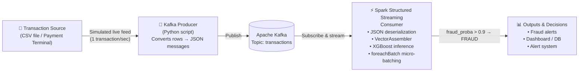

# 🛡️ Real-Time Credit Card Fraud Detection
### A production-grade ML pipeline using Apache Kafka · Apache Spark Streaming · XGBoost

[](https://python.org)
[](https://spark.apache.org)
[](https://kafka.apache.org)
[](https://xgboost.readthedocs.io)
[](LICENSE)

> A Master's-level research project (MIATE — Université Mohammed Premier) that detects fraudulent bank card transactions **in real time** by combining a high-performance XGBoost classifier (99.96% accuracy, 100% recall) with a scalable Kafka + Spark Structured Streaming architecture.

---

## 📑 Table of Contents

1. [Project Overview](#-project-overview)
2. [System Architecture](#-system-architecture)
3. [Dataset](#-dataset)
4. [Model Performance](#-model-performance)
5. [Project Structure](#-project-structure)
6. [Installation](#-installation)
7. [Running the Pipeline](#-running-the-pipeline)
8. [Technical Deep Dive](#-technical-deep-dive)
9. [Results](#-results)
10. [Authors](#-authors)
11. [References](#-references)

---

## 🎯 Project Overview

Banking fraud is a growing threat in the era of electronic payments. Traditional rule-based systems struggle to keep pace with evolving fraud patterns. This project addresses that gap by:

- Training and comparing **6 ML models** on a heavily imbalanced real-world dataset
- Applying a **combined rebalancing strategy** (under-sampling + over-sampling + sample weights)
- Deploying the best model (**XGBoost**) inside a **real-time streaming pipeline** using Kafka and Spark Structured Streaming
- Applying a **decision threshold of 0.9** to minimize missed fraud (false negatives), reflecting the real business cost of undetected fraud

The final system processes transactions as they arrive, assigns a fraud probability to each, and flags suspicious ones — all within milliseconds.

---

## 🏗️ System Architecture



**Data flow in plain English:**

1. A **Kafka Producer** reads transactions from a CSV file row-by-row, converts each to JSON, and publishes it to a Kafka topic — simulating a live payment terminal.
2. **Spark Structured Streaming** subscribes to that topic, deserializes the JSON, assembles feature vectors with `VectorAssembler`, loads the pre-trained XGBoost model, and runs inference on each micro-batch.
3. Any transaction whose `fraud_proba` exceeds **0.90** is classified as fraud and surfaced in the output.

---

## 📊 Dataset

| Property | Value |
|---|---|
| Source | [Kaggle — European Credit Card Transactions](https://www.kaggle.com/datasets/mlg-ulb/creditcardfraud) |
| Total transactions | 284,807 |
| Fraudulent transactions | 492 (≈ 0.17%) |
| Features | 30 numerical (V1–V28 via PCA, `Time`, `Amount`) |
| Target variable | `Class` (0 = normal, 1 = fraud) |

### Class Imbalance Strategy

The severe 577:1 imbalance was handled with a three-step approach:

```
Original dataset (284,807 rows)
│
├── Class 0 (Normal) ──► Under-sample to ~40% → reduces majority dominance
│
├── Class 1 (Fraud)  ──► Over-sample with replacement → boosts minority recall
│
└── Combined balanced set + `weight` column
        └── Adjusts each sample's influence during training
            to compensate for residual imbalance
```

---

## 🏆 Model Performance

All models were evaluated on a held-out validation set using Accuracy, Precision, Recall, and F1-score.

| Model | Accuracy | Precision | Recall | F1-Score | Overfitting |
|---|---|---|---|---|---|
| **XGBoost** ⭐ | **99.96%** | **99.29%** | **100%** | **99.64%** | Negligible |
| Gradient Boosted Trees | 99.56% | 98.23% | 94.61% | 96.38% | Negligible |
| Decision Tree | 97.51% | 97.91% | 97.31% | 97.49% | Negligible |
| Logistic Regression | 97.31% | 97.79% | 97.31% | 97.47% | Negligible |
| Random Forest | 97.50% | 92.00% | 94.00% | 93.00% | Minimal |
| Isolation Forest | 96.00% | 60.00% | 85.00% | 69.11% | Negligible |

> **Why XGBoost?** It achieved **zero false negatives** on the validation set (recall = 100%) — meaning no fraudulent transaction was missed. Its gradient boosting mechanism with built-in regularization makes it both highly accurate and resistant to overfitting, as confirmed by the near-identical train/validation F1-scores (99.85% vs 99.64%).

---


## ⚙️ Installation

### Prerequisites

- Python 3.8+
- Java 8 or 11 (required by Apache Spark)
- Apache Kafka 3.x ([download](https://kafka.apache.org/downloads))
- Apache Spark 3.x ([download](https://spark.apache.org/downloads.html))

### Step 1 — Clone the repository

```bash
git clone https://github.com/SaraSouhail/Credit-Card-Fraud-Detection.git
cd Credit-Card-Fraud-Detection
```

### Step 2 — Create and activate a virtual environment

```bash
python -m venv venv

# On Linux/macOS
source venv/bin/activate

# On Windows
venv\Scripts\activate
```

### Step 3 — Install Python dependencies

```bash
pip install -r requirements.txt
```

`requirements.txt` includes:

```txt
pyspark>=3.3.0
kafka-python>=2.0.2
xgboost>=1.7.0
scikit-learn>=1.2.0
pandas>=1.5.0
numpy>=1.23.0
```

### Step 4 — Download the dataset

Download `creditcard.csv` from [Kaggle](https://www.kaggle.com/datasets/mlg-ulb/creditcardfraud) and place it in `data/raw/`.

---

## ▶️ Running the Pipeline

### 1. Start Zookeeper and Kafka

```bash
# Terminal 1 — Start Zookeeper
$KAFKA_HOME/bin/zookeeper-server-start.sh $KAFKA_HOME/config/zookeeper.properties

# Terminal 2 — Start Kafka broker
$KAFKA_HOME/bin/kafka-server-start.sh $KAFKA_HOME/config/server.properties
```

### 2. Create the Kafka topic

```bash
$KAFKA_HOME/bin/kafka-topics.sh \
  --create \
  --topic transactions \
  --bootstrap-server localhost:9092 \
  --partitions 1 \
  --replication-factor 1
```

### 3. Train the model (if not already serialized)

```bash
# Run the training notebook, or:
python scripts/train_model.py
# Saves model to models/xgboost_model.pkl
```

### 4. Start the Spark Streaming Consumer

```bash
# Terminal 3
spark-submit \
  --packages org.apache.spark:spark-sql-kafka-0-10_2.12:3.3.0 \
  scripts/spark_consumer.py
```

### 5. Start the Kafka Producer

```bash
# Terminal 4
python scripts/kafka_producer.py \
  --input data/processed/test_data.csv \
  --topic transactions \
  --delay 0.5  # seconds between transactions
```

You should now see live micro-batch output in Terminal 3 similar to:

```
========== BATCH 18 ==========
✅ No fraud detected in this batch
Rows in batch: 11 | TOTAL rows seen: 1,551 | TOTAL fraud predicted: 17

========== BATCH 2291 ==========
🚨 FRAUD DETECTED:
   fraud_proba: 0.9999  → prediction: 1  (FRAUD)
   fraud_proba: 0.9942  → prediction: 1  (FRAUD)
Rows in batch: 4 | TOTAL rows seen: 23,990 | TOTAL fraud predicted: 1,702
```

---

## 🔬 Technical Deep Dive

### Why Kafka + Spark Structured Streaming?

Traditional batch processing waits until a full dataset is available before running predictions — unacceptable in banking where a fraudulent transaction must be blocked **before** it is authorized.

| Concern | Batch Processing | Our Streaming Approach |
|---|---|---|
| Latency | Minutes to hours | Sub-second |
| Scalability | Limited | Horizontally scalable |
| Real-time blocking | ❌ Not possible | ✅ Native |
| Fault tolerance | Manual | Kafka offsets + Spark checkpointing |

**Micro-batching** (Spark's approach) groups arriving Kafka messages into small time windows (e.g., every 500ms), applies the full preprocessing + inference pipeline via `foreachBatch`, and emits results — achieving near-real-time latency with the reliability guarantees of batch processing.

### Decision Threshold: Why 0.9?

XGBoost outputs a probability score `fraud_proba ∈ [0, 1]`. Rather than using the default 0.5 cutoff, we set the threshold to **0.9** because:

> In fraud detection, the cost of a **missed fraud** (false negative) far exceeds the cost of a **false alarm** (false positive). A high threshold ensures only highly confident fraud signals trigger an alert, reducing alert fatigue while still catching all fraud.

---

## 📈 Results

The real-time deployment confirmed the model's production viability:

- **23,990 transactions** processed in a single streaming run
- **1,702 fraudulent transactions** correctly identified
- Fraud probability on detected fraud batches consistently **> 99%**
- Zero excessive false alarms observed across clean micro-batches

The gap between the training F1-score (99.85%) and validation F1-score (99.64%) is negligible, confirming **no overfitting**.

---

## 👩‍💻 Authors

This project was developed as part of the **Master MIATE** (Intelligence Artificielle et Technologies Émergentes) program at the **Faculté Pluridisciplinaire de Nador, Université Mohammed Premier** — academic year 2024–2025.

| Name | Role |
|---|---|
| **Khadija Bouchama** | ML modeling, data rebalancing, evaluation |
| **Sara Souhail** | Kafka/Spark architecture, streaming deployment |
| **Saadia Kassidi** | EDA, feature engineering, documentation |

**Supervisor:** Pr. Siham Essahraui

---

## 📚 References

1. Ashqar, H. I., & Aburbeian, A. M. (2023). *Credit Card Fraud Detection Using Enhanced Random Forest Classifier for Imbalanced Data.*
2. Feng, X. & Kim, S.-K. (2024). *Novel Machine Learning Based Credit Card Fraud Detection Systems.* Mathematics, 12, 1869.
3. Ileberi, E. et al. (2022). *A machine learning based credit card fraud detection using the GA algorithm for feature selection.* Journal of Big Data, 9.
4. Bhattacharyya, S. et al. (2011). *Data mining for credit card fraud: A comparative study.* Decision Support Systems, 50(3).
5. Chen, C., Liaw, A., & Breiman, L. (2004). *Using random forest to learn imbalanced data.* UC Berkeley Technical Report.
6. Chen, T. & Guestrin, C. (2016). *XGBoost: A scalable tree boosting system.* ACM SIGKDD.
7. Theodorakopoulos, L. et al. (2024). *Credit Card Fraud Detection with ML and Big Data Analytics: A PySpark Framework.* Preprints.
8. He, J. (2024). *Real-Time Credit Card Fraud Detection Based on ML and Apache Spark.* SciTePress.
9. Liu, F. T., Ting, K. M., & Zhou, Z. H. (2008). *Isolation Forest.* IEEE ICDM.

---

<div align="center">
  <sub>Built with ❤️ at Université Mohammed Premier · Nador, Morocco</sub>
</div>
